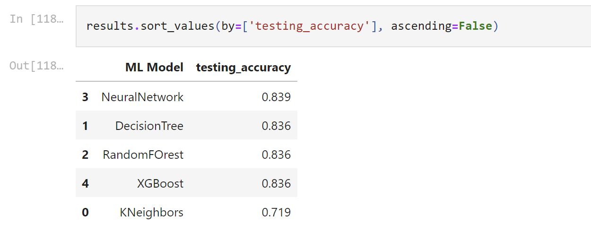
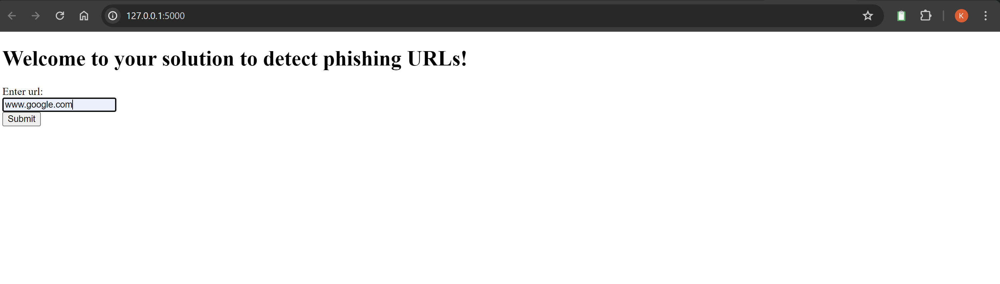
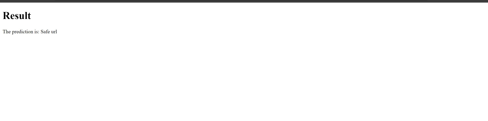
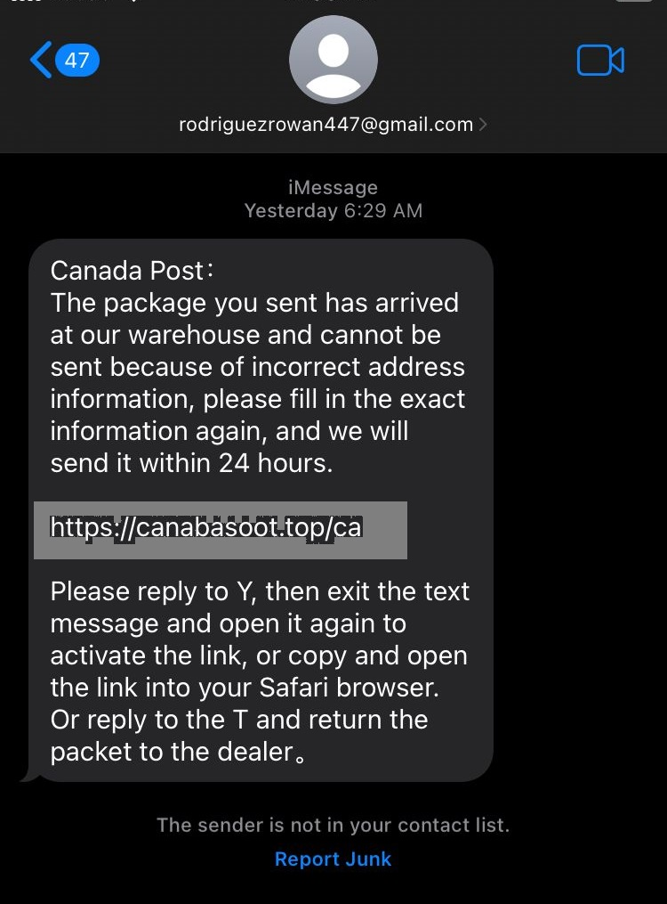
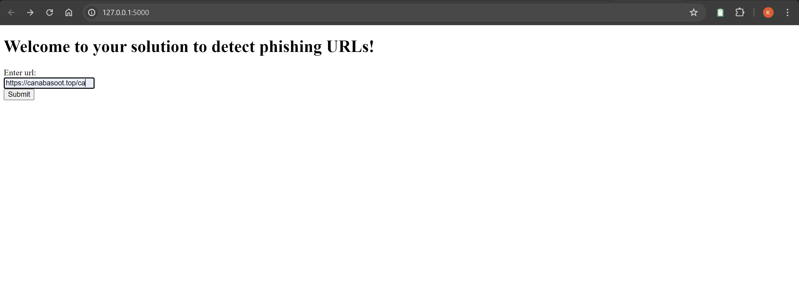
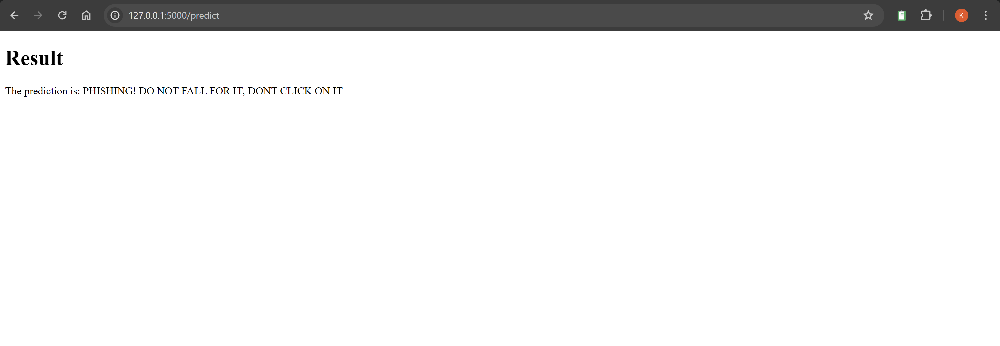

<h2>PhishDetect: Phishing URL Detection with Machine Learning</h2>

PhishDetect is an open-source cybersecurity project aimed at detecting phishing URLs using cutting-edge machine learning techniques. Phishing attacks continue to pose a significant threat to individuals and organizations worldwide, making it crucial to have effective tools for identifying and mitigating these risks. PhishDetect provides a robust solution by leveraging machine learning algorithms to accurately differentiate between malicious and legitimate URLs.

<h2>Features</h2>

<h3>Machine Learning Approach</h3>

PhishDetect employs a comprehensive machine learning pipeline to detect phishing URLs:

- Data Collection and Preprocessing: Gather a diverse dataset of phishing and legitimate URLs and preprocess the data for analysis.
  
- Feature Engineering: Extract relevant features from URLs, including IP address presence, URL length, domain age, URL shortening usage, web traffic analysis, iframe detection, status bar manipulation, and right-click disable detection.

- Model Training: Train machine learning models using various algorithms, such as KNeighbors, DecisionTree, RandomForest, NeuralNetwork, and XGBoost, and select the best-performing model (Neural networks) based on evaluation metrics.

- Model Evaluation: Assess model performance through cross-validation and testing on unseen data to ensure reliable phishing detection.

<h3>Cybersecurity Features</h3>

PhishDetect incorporates several cybersecurity features to enhance phishing URL detection:

- IP Address Detection: Identifies URLs containing IP addresses, a common tactic used by phishers to deceive users.

- URL Length Analysis: Flags excessively long URLs, often associated with phishing attempts.

- Domain Age Analysis: Utilizes WHOIS data to determine domain age, helping identify newly registered domains commonly used in phishing attacks.

- URL Shortening Detection: Detects the use of URL shortening services, which are frequently employed to disguise malicious links.

- Web Traffic Analysis: Analyzes web traffic patterns to identify suspicious domains with low or no traffic, indicative of phishing websites.

- Iframe Detection: Detects invisible iframes, a technique used by phishers to overlay content and deceive users.

- Status Bar Manipulation Detection: Identifies attempts to manipulate the status bar to display fake URLs and deceive users.

- Right-Click Disable Detection: Detects attempts to disable right-click functionality, commonly done to prevent users from viewing source code and inspecting URLs.

<h2>Usage</h2>

To use PhishDetect, simply clone the repository and install the needed dependencies mentioned in required.txt file and navigate to flaskApp and run `python app.py`. You can input URLs for real-time phishing detection and leverage the power of machine learning to safeguard against phishing attacks.

<h2>here's a phishing url I received and tested with my app: </h2>

<h2>Contribution</h2>

Contributions to PhishDetect are welcome! Whether you're a cybersecurity enthusiast or a machine learning expert, your contributions can help improve phishing URL detection and enhance cybersecurity defenses for everyone.

<h2>License</h2>

PhishDetect is licensed under the [MIT License](LICENSE), allowing for both personal and commercial use with proper attribution.

<h2>Disclaimer</h2>

PhishDetect is a research project and should be used alongside other cybersecurity measures for comprehensive protection. Always exercise caution when interacting with URLs, especially those from unfamiliar sources.

---

Stay vigilant against phishing attacks with PhishDetect, your trusted ally in cybersecurity defense. Let's work together to make the internet a safer place for everyone! 🛡️
